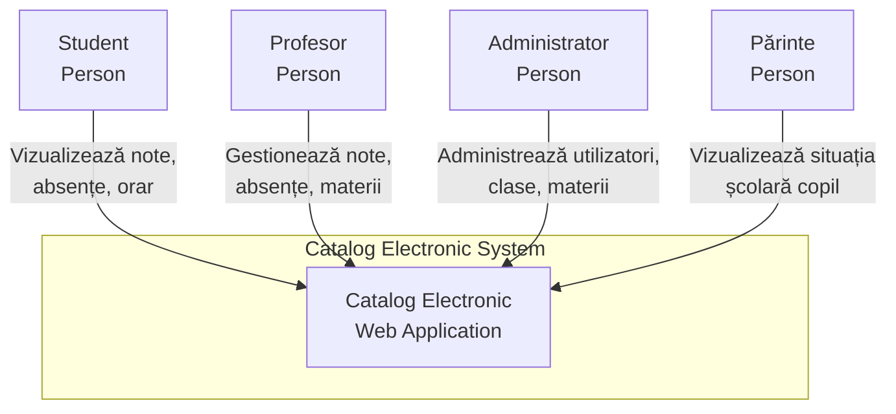
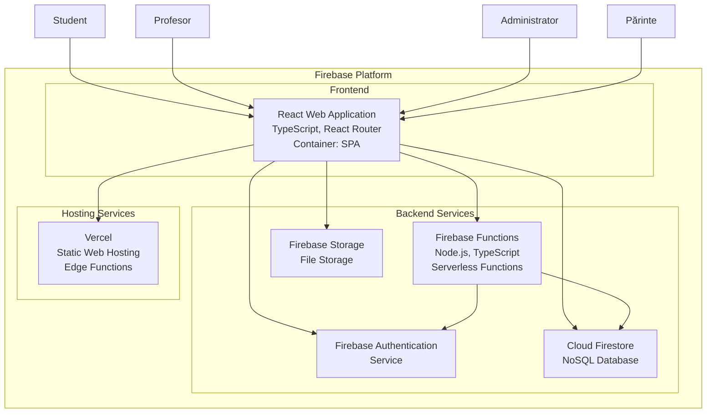
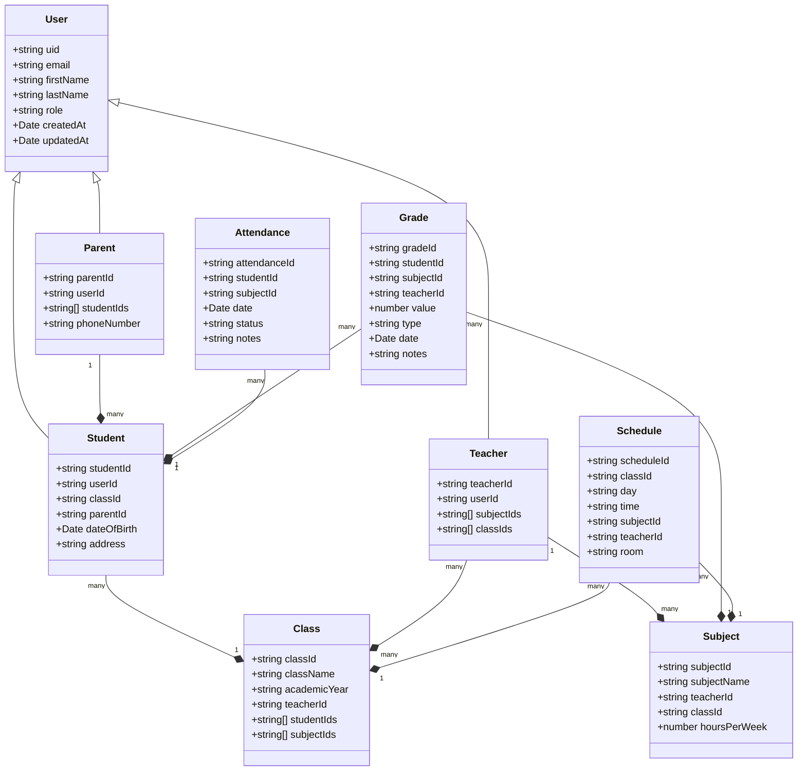

# Diagrame C4 - Catalog Electronic

## 1. Context Diagram (Level 1)

## 2. Container Diagram (Level 2)

## 3. Component Diagram (Level 3)

```mermaid
graph TB
    subgraph "React Web Application"
        subgraph "Authentication Layer"
            LoginComponent[Login Component]
            AuthContext[Auth Context/Provider]
            ProtectedRoute[Protected Routes]
        end
        
        subgraph "UI Components"
            Dashboard[Dashboard Component]
            GradeManagement[Grade Management<br/>Component]
            AttendanceManagement[Attendance Management<br/>Component]
            ClassManagement[Class Management<br/>Component]
            UserManagement[User Management<br/>Component]
            Reports[Reports Component]
            Schedule[Schedule Component]
        end
        
        subgraph "Services"
            AuthService[Authentication Service]
            DataService[Data Service]
            NotificationService[Notification Service]
            ReportService[Report Service]
        end
        
        subgraph "State Management"
            ReduxStore[Redux Store/<br/>Context API]
        end
    end
    
    subgraph "Firebase Functions"
        subgraph "API Functions"
            GradeCalculation[Grade Calculation<br/>Function]
            NotificationTrigger[Notification Trigger<br/>Function]
            ReportGeneration[Report Generation<br/>Function]
            DataValidation[Data Validation<br/>Function]
        end
        
        subgraph "Scheduled Functions"
            DailyReports[Daily Reports<br/>Function]
            AttendanceCheck[Attendance Check<br/>Function]
        end
        
        subgraph "Database Triggers"
            OnGradeChange[On Grade Change<br/>Trigger]
            OnAttendanceUpdate[On Attendance Update<br/>Trigger]
        end
    end
    
    LoginComponent --> AuthService
    Dashboard --> DataService
    GradeManagement --> DataService
    AttendanceManagement --> DataService
    ClassManagement --> DataService
    UserManagement --> DataService
    Reports --> ReportService
    
    AuthService --> AuthContext
    DataService --> ReduxStore
    NotificationService --> ReduxStore
    
    DataService --> GradeCalculation
    DataService --> DataValidation
    NotificationService --> NotificationTrigger
    ReportService --> ReportGeneration
```

## 4. Code/Class Diagram (Level 4) - Main Data Models

## Arhitectură tehnică detaliată

### Frontend (React)
- **Framework**: React 18+ cu TypeScript
- **Routing**: React Router v6
- **State Management**: Redux Toolkit sau Context API
- **UI Library**: Material-UI sau Ant Design
- **Forms**: React Hook Form cu Yup validation
- **API Communication**: Axios sau Firebase SDK

### Backend (Firebase)
- **Authentication**: Firebase Auth (Email/Password, Google OAuth)
- **Database**: Cloud Firestore cu structură NoSQL optimizată
- **Functions**: Node.js 18+ cu TypeScript
- **Storage**: Firebase Storage pentru documente și rapoarte

### Hosting & Deployment (Vercel)
- **Platform**: Vercel pentru deployment și hosting
- **Edge Functions**: Vercel Edge Functions pentru optimizare
- **CDN**: Vercel Edge Network cu 100+ PoP-uri globale
- **CI/CD**: Automatic deployments din GitHub
- **Preview Deployments**: Automatic preview pentru fiecare PR

### Security
- **Authentication**: Multi-factor authentication disponibilă
- **Authorization**: Role-based access control (RBAC)
- **Data Validation**: Schema validation în Functions
- **Rate Limiting**: Firebase Security Rules
- **Encryption**: TLS/SSL pentru toate conexiunile

### Scalability
- **Auto-scaling**: Firebase Functions scalează automat
- **Caching**: Firestore offline persistence + Vercel Edge Cache
- **CDN**: Vercel Edge Network pentru assets și pagini
- **Load Balancing**: Gestionat automat de Firebase și Vercel
- **Edge Functions**: Vercel Edge Functions pentru response-uri rapide

### Monitoring
- **Performance**: Firebase Performance Monitoring
- **Analytics**: Firebase Analytics
- **Error Tracking**: Firebase Crashlytics
- **Logging**: Cloud Logging pentru Functions